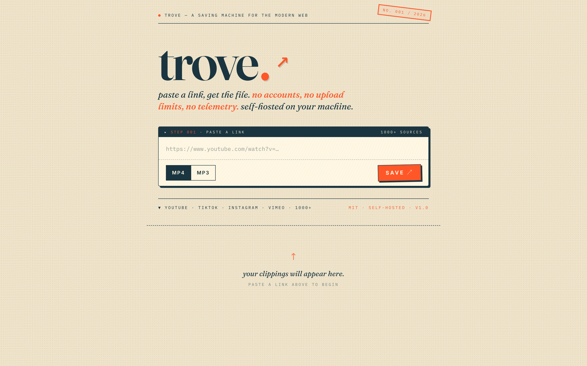
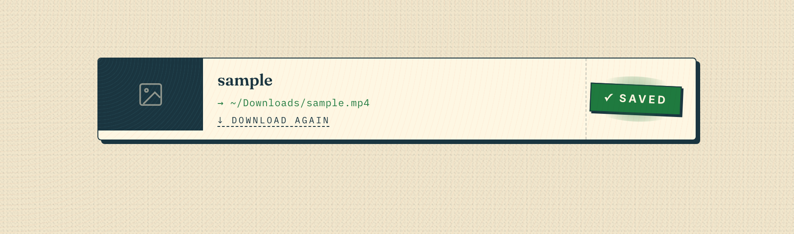
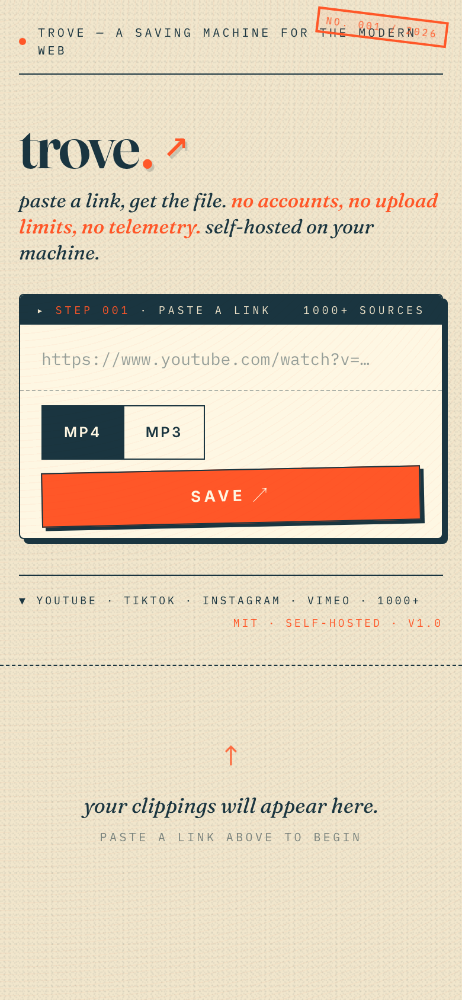

# trove.

*a saving machine for the modern web.*

paste a link, get the file. no accounts, no upload limits, no telemetry. self-hosted on your machine, powered by [yt-dlp](https://github.com/yt-dlp/yt-dlp) and [ffmpeg](https://ffmpeg.org/) — works on YouTube, TikTok, Instagram, Vimeo, and ~1000 other sites.



---

## what's inside

- one paste box, one click. videos and audio save to your device.
- live progress bar with %, MB, fragment count, and ETA — even on YouTube's HLS streams.
- bulk paste, MP4/MP3 toggle, quality picker.
- mobile-friendly. light only — riso paper is the brand.
- single Python process, single Docker container, no Node.

|  |  |
|---|---|
| **mid-download** | **saved** |

---

## quick start

```bash
brew install yt-dlp ffmpeg     # macOS — or apt install ffmpeg && pip install yt-dlp
git clone https://github.com/afk1997/trove.git
cd trove
./trove.sh
```

open **http://localhost:8899** and paste something.

or with Docker:

```bash
docker build -t trove .
docker run -p 8899:8899 -e HOST=0.0.0.0 trove
```

*the `-e HOST=0.0.0.0` is required for Docker port-forwarding. for LAN/internet exposure, also set `TROVE_TOKEN` — see below.*

<p align="center">
  
</p>

## configuration (env vars)

| variable | default | what it does |
|---|---|---|
| `HOST` | `127.0.0.1` | bind address. set to `0.0.0.0` only with a token. |
| `PORT` | `8899` | TCP port. |
| `TROVE_TOKEN` | *(unset)* | when set, every `/api/*` request must send `Authorization: Bearer <token>`. |
| `TROVE_COOKIES_FROM_BROWSER` | *(unset)* | one of `safari\|chrome\|firefox\|brave\|edge`. required for YouTube right now (Google blocks cookieless yt-dlp). |
| `TROVE_CONCURRENT_FRAGMENTS` | `4` | parallel fragment downloads for HLS streams (YouTube etc.). clamped 1–32. |
| `TROVE_JOB_TTL_SECONDS` | `3600` | how long completed jobs (and their files) linger before being swept. |
| `TROVE_MAX_WORKERS` | `4` | concurrent downloads. excess returns HTTP 503. |
| `TROVE_RATE_LIMIT` | `30` | requests per minute per IP. set to `0` to disable. |

> **Note on `TROVE_TOKEN` + tab-close auto-pause:** when a token is set, the browser's `navigator.sendBeacon` cannot attach the `Authorization` header, so closing the tab mid-download will not POST to `/api/job/<id>/pause`. The job stays running until the server stops; on restart, any non-completed job is downgraded to `paused` and reappears in the queue, so no work is lost — the UX is just deferred until restart. Local (`HOST=127.0.0.1`, no token) deployments are unaffected.

## exposing to LAN or the internet

the defaults assume **localhost only**. to expose trove safely:

1. set a token: `export TROVE_TOKEN=$(openssl rand -hex 32)`
2. set host: `export HOST=0.0.0.0`
3. run behind a reverse proxy that adds HTTPS (Caddy, nginx, fly.io, etc.).

without `TROVE_TOKEN`, anyone who can reach the port can download.

## YouTube and cookies

cookies are **recommended** for YouTube. short, public, non-monetized videos often work without them, but YouTube will eventually serve a sign-in wall for age-restricted content, certain regions, or longer/monetized uploads. to use cookies from your browser:

```bash
export TROVE_COOKIES_FROM_BROWSER=safari   # or chrome / firefox / brave / edge
./trove.sh
```

the browser must be installed on the host and have an active YouTube session.

## stack

- **backend:** Python 3.12 + Flask
- **frontend:** htmx 2 + vanilla JS + Tailwind CSS (standalone CLI, no Node at runtime)
- **engine:** yt-dlp + ffmpeg
- **typography:** [Fraunces](https://fonts.google.com/specimen/Fraunces) (display, with the WONK + opsz variable axes), [Inter](https://fonts.google.com/specimen/Inter) (UI), [IBM Plex Mono](https://fonts.google.com/specimen/IBM+Plex+Mono) (stamps)

## disclaimer

this tool is for personal use. respect copyright laws and the terms of service of platforms you download from.

## license

MIT. see [LICENSE](LICENSE).

---

inspired by [averygan/reclip](https://github.com/averygan/reclip) (MIT).
